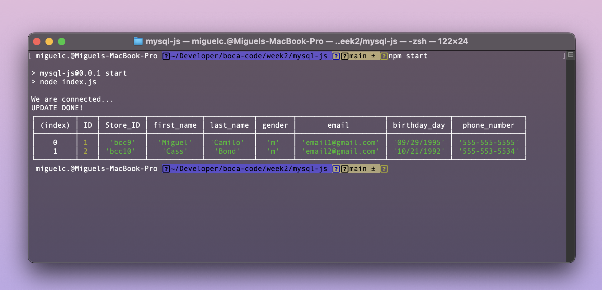

# MySQL with JavaScript

Week 2 Day 2 we focused on connecting SQL with JavaScript using node and using simple querys to manipulate a database. Also how to work with Node Packages.

## Lesson Learned

1. Node
2. NPM
3. MySQL
4. Secrets

## See the the repo [click here.](https://github.com/MiguelCamilo/MySQL-JS-c9)

